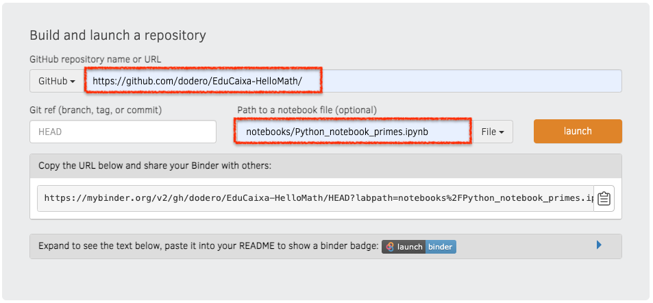

# Paradigmas de programación informática para el pensamiento algebraico y computacional  

## Resumen  

*La mejora de las habilidades de pensamiento computacional puede variar según el lenguaje de programación elegido. La ponencia tratará sobre la problemática de los conceptos y prácticas del pensamiento computacional, tales como la abstracción y la algoritmia, así como su puesta en práctica a través de los distintos paradigmas de programación informática. También se discutirá la influencia de estos conceptos en los saberes matemáticos y el pensamiento algebraico, a través de ejemplos prácticos.*  

## Materiales

### Teoría

- El contenido teórico del seminario está disponible en unos breves [apuntes](markdown/HelloMath.md).
- Las [transparencias](slides/HelloMath.slides.html) del seminario están generadas desde Jupyter con RISE, usando el framework reveal.js

### Práctica

- El reto práctico consiste en la realización de un taller de programación para el cálculo de números primos, utilizando el lenguaje Python. En el taller se analizarán las características imperativas y funcionales del lenguaje de programación, en relación al sentido más o menos algebraico de cada uno de los paradigmas de programación aplicados.
- El taller está disponible en un [Jupyter notebook](https://jupyter.org/), disponible en [Github](notebooks/Python_notebook_primes.ipynb), [MyBinder](https://mybinder.org/) y [Google Colab]().

#### Instrucciones

Para desplegar una copia personal del notebook [Cálculo de números primos](notebooks/Python_notebook_primes.ipynb) en MyBinder, hay que rellenar el formulario disponible en [MyBinder](https://mybinder.org/) con los siguientes datos:

