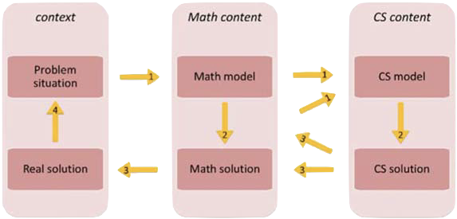

# Paradigmas de programación informática para el pensamiento algebraico y computacional  

## Resumen  

*La mejora de las habilidades de pensamiento computacional puede variar según el lenguaje de programación elegido. La ponencia tratará sobre la problemática de los conceptos y prácticas del pensamiento computacional, tales como la abstracción y la algoritmia, así como su puesta en práctica a través de los distintos paradigmas de programación informática. También se discutirá la influencia de estos conceptos en los saberes matemáticos y el pensamiento algebraico, a través de ejemplos prácticos.*  

[1. Antecedentes: el curriculum de Matemáticas en la LOMLOE](#antecedentes)

- El sentido algebraico
- El pensamiento computacional

[2. La resolución de problemas](#resolucion-problemas)

- Resolución de problemas en matemáticas e informática
- Resolución de problemas en tecnología
- La transferencia de aprendizaje

[3. El pensamiento computacional](#pensamiento)

- Conceptos y prácticas del pensamiento computacional
- El pensamiento computacional en Matemáticas
- Informática y pensamiento computacional
- Aspectos fundamentales de la informática
- Pensamiento algebraico

[4. Algoritmos](#algoritmos)

- Variables
  - Las variables en los lenguajes de programación
  - Representar el tiempo
  - Representar objetos (no numéricos)
  - Ejemplo de algoritmo en Snap!: números pares e impares
- Funciones
  - Ejemplo de expresión funcional en Snap!
- Otros ejemplos de lenguaje algebraico y lenguaje computacional
  - Python y sus bibliotecas
  - Unity y sus bibliotecas

[5. Lenguajes de programación](#lenguajes)

- Sentido algebraico en los lenguajes de programación informática
- Programación y codificación
- Lenguaje algebraico y programación

[6. Abstracción](#abstraccion)

- [RETO: Criba de Eratóstenes en Python](#eratostenes)
- Diferencia semiótica](#semiotica)

[7. Trabajos futuros](#futuro)

- [Organización de datos
- [Depuración de errores
- [Análisis y descomposición
- [Identificación de patrones

---

<div id="antecedentes"/>

## 1. Antecedentes: el curriculum de Matemáticas en la LOMLOE

El curriculum reciente de la LOMLOE propuesto para la ESO y Bachillerato [RD 217/2002](https://www.boe.es/diario_boe/txt.php?id=BOE-A-2022-4975) indica que la adquisición de las **competencias específicas** en Matemáticas se lleva a cabo a través de un conjunto de **saberes básicos** que integran conocimientos, destrezas y actitudes.

Los saberes se estructuran en torno al concepto de **sentido matemático**. Los distintos sentidos (numérico, medida, espacial, algebraico, estocástico, socioafectivo) permiten emplear los saberes básicos de una manera funcional. El RD 217/2022 también indica que:  
  
> Por razones organizativas, en el **sentido algebraico** se ha incorporado el apartado **pensamiento computacional**, que no es exclusivo del sentido algebraico y debe trabajarse de forma transversal a lo largo de todo el proceso de enseñanza de la materia.  

### El sentido algebraico

El **sentido algebraico** consta de los siguientes elementos:

- *Patrones* − Patrones, pautas y regularidades: observación y determinación de la regla de formación en casos sencillos.  
- *Modelo matemático* – Modelización de situaciones de la vida cotidiana usando representaciones matemáticas y el lenguaje algebraico. Estrategias de deducción de conclusiones razonables a partir de un modelo matemático.
- *Variable* − comprensión del concepto en sus diferentes naturalezas.
- *Igualdad y desigualdad* − Relaciones lineales y cuadráticas, [...] Álgebra simbólica. [...] Ecuaciones: resolución mediante el uso de la tecnología.
- *Relaciones y funciones* − Relaciones cuantitativas [...] y clases de funciones que las modelizan. Relaciones lineales y cuadráticas [...] Uso de diferentes representaciones simbólicas.
- Pensamiento computacional

En el RD 217/2022 se incluye, para la materia de **matemáticas**, numerosas menciones al término **pensamiento computacional**. La primera de las menciones lo relaciona con la **resolución de problemas**:

> Relacionado con la resolución de problemas se encuentra el pensamiento computacional. Este incluye el análisis de datos, la organización lógica de los mismos, la búsqueda de soluciones en secuencias de pasos ordenados y la obtención de soluciones con instrucciones que puedan ser ejecutadas por una herramienta tecnológica programable, una persona o una combinación de ambas, lo cual amplía la capacidad de resolver problemas y promueve el uso eficiente de recursos digitales. — BOE Nº 76, Sec. I. Pág. 41725  

Los elementos básicos anteriores del sentido algebraico (patrón, modelo, variable, igualdad y función) nos van a servir más adelante para comparar el pensamiento algebraico y el pensamiento computacional a la hora de desplegar el aprendizaje de los saberes básicos de una manera funcional. Por el momento, como ya tenemos identificado dónde se encuadra el pensamiento computacional en matemáticas (en el sentido algebraico *por razones organizativas*), vamos a analizarlo un poco más en profundidad.

### El pensamiento computacional

El pensamiento computacional se estructura en la materia de matemáticas a dos niveles:  

- Matemáticas A:
  - Generalización y transferencia de procesos de resolución de problemas a otras situaciones.
  - Estrategias útiles en la interpretación y modificación de algoritmos.
  - Estrategias de formulación de cuestiones susceptibles de ser analizadas mediante programas y otras herramientas.

- Matemáticas B:  
  - Resolución de problemas mediante la descomposición en partes, la automatización y el pensamiento algorítmico.
  - Estrategias en la interpretación, modificación y creación de algoritmos.
  - Formulación y análisis de problemas de la vida cotidiana mediante programas y otras herramientas.

En definitiva, parece que el pensamiento computacional en Matemáticas tiene que ver con:

- La resolución de problemas
- La transferencia a otras situaciones
- Los algoritmos y el pensamiento algorítmico
- La descomposición en partes y la abstracción
- La automatización
- La formulación y el análisis mediante programas

Por tanto, los anteriores elementos son los que van a guiar esta ponencia:

- Primero analizaremos qué se entiende por resolución de problemas desde el punto de vista de las distintas disciplinas involucradas (sobre todo las matemáticas y la informática) y si existe transferencia de aprendizaje o transposición didáctica entre distintas situaciones y contextos educativos.
- Luego entraremos de lleno en el pensamiento computacional, su caracterización y sus implicaciones en el sentido algebraico, tanto en matemáticas como en informática.
- Para acabar, dedicaremos tiempo (y haremos algunos ejemplos prácticos) a tres de los conceptos fundamentales sobre los que sobrevuela el pensamiento computacional: los **algoritmos**, la **programación informática** y, finalmente, la **abstracción**. Este recorrido lo haremos sin perder nunca de vista el sentido algebraico.

---

<div id="resolucion-problemas"/>

## 2. La resolución de problemas  

¿Qué tiene que ver el pensamiento computacional con la resolución de problemas? ¿Es lo mismo resolver un problema para las Matemáticas que para la Informática? Veamos algo de lo que dice la investigación al respecto de la resolución de problemas en matemáticas e informática:  

En Matemáticas, resolver un problema implica «encontrar un resultado definitivo para una determinada clase de problemas» ([Bråtig & Kilham, 2021](https://doi.org/10.1080/10986065.2020.1779012)).

- Para estudiar la diferencia entre resolver un problema en matemáticas y resolverlo en programación informática, ([Bråtig & Kilham, 2021](https://doi.org/10.1080/10986065.2020.1779012)) usan ejemplos en los que los estudiantes resuelven una tarea simple de programación por bloques a través de un juego de programación llamado [Lightbot](https://lightbot.com/).

  
  > Lightbot es un juego de puzzle para enseñar la lógica más elemental de la programación informática (secuencias, bucles, condicionales, etc.)

- Luego explican que, con las tareas simples de programación que plantea el juego, se aprende a resolver un problema específico, pero no «una determinada clase de problemas».
- Según los autores anteriores, resolver un problema en matemáticas no es exactamente lo mismo que resolverlo en programación informática.

### Resolución de problemas en matemáticas e informática

La interrelación entre el **pensamiento matemático** y el pensamiento computacional a la hora de resolver un problema se ha descrito de la siguiente forma ([Kallia et al., 2021](https://doi.org/10.1080/14794802.2020.1852104)):



1. Trasladar una situación o problema real a un modelo matemático y luego a un modelo computacional, fundamentado en las capacidades de abstracción, modelado e identificación de patrones.
2. Razonar y trabajar con los conceptos y prácticas propias de las matemáticas y de la informática.
3. Trasladar los resultados al contexto original del problema, fundamentado en capacidades de generalización.
4. Verificar que realmente se resuelve el problema real, a través de capacidades de evaluación.

### Resolución de problemas en tecnología

Aprender a resolver un problema también es el objetivo de las materias más relacionadas con la tecnología, como la robótica y otras. En la investigación sobre el tema, se han desarrollado cursos con distintos enfoques para un mismo objetivo relacionado con la resolución de problemas y el pensamiento computacional. Por ejemplo, ([Weese & Feldhausen, 2017]([https://peer.asee.org/28845](https://doi.org/10.18260/1-2--28845))) desarrollaron dos curricula diferentes para un curso de verano sobre STEM. El primero usaba micro-controladores como medio para desarrollar las habilidades de pensamiento computacional y resolución de problemas; el segundo era un curso puro de informática. Hallaron que el primero de los curricula fue menos efectivo en la adquisición de habilidades de resolución de problemas.

### La transferencia de aprendizaje

Todas estas experiencias nos dan qué pensar: ¿Es clara la diferencia entre la resolución de problemas en matemáticas y la resolución de problemas en informática? ¿y en otras disciplinas? ¿Existe algún tipo de **transferencia** de aprendizaje o **transposición** entre ambas disciplinas? ¿Cuál es la relación entre el pensamiento computacional y la resolución de problemas (tal y como señala la LOMLOE)?

- La **transferencia de aprendizaje** es la aplicación de habilidades (o conocimiento, estrategias, métodos o hábitos) aprendidas en un contexto a otro contexto nuevo ([Ambrose et al., 2010](https://www.wiley.com/en-us/How+Learning+Works:+Seven+Research+Based+Principles+for+Smart+Teaching-p-9780470484104)). La transferencia de aprendizaje es más probable que sea exitosa cuando se lleva a cabo entre dominios relacionados (por ejemplo, entre las matemáticas y la informática).  
- La noción de **transposición didáctica** fue introducida en las matemáticas para referirse a la transformación de un objeto de conocimiento desde el momento en que se produce, se usa y se diseña para su aprendizaje hasta el momento en que se enseña de manera efectiva en una escuela o un contexto determinado ([Chevallard & Bosch, 2014](https://doi.org/10.1007/978-94-007-4978-8_48)). Se produce una **transposición** al elaborar la solución a un problema (matemático) de forma que ésta pueda ser transferida a otra persona **o a una máquina** ([Kallia et al., 2021](https://doi.org/10.1080/14794802.2020.1852104)).

---

<div id="pensamiento"/>

## 3. El pensamiento computacional

Para poder caracterizar en qué consiste el pensamiento computacional, acudimos a algunas definiciones.  

### Conceptos y prácticas del pensamiento computacional  

Hay muchas definiciones de *computational thinking* que han planteado mucha controversia:  

- ([Brennan & Resnick, 2012](http://scratched.gse.harvard.edu/ct/files/AERA2012.pdf)) mencionan:  
  - **Conceptos** – Secuencias / Bucles / Eventos / Paralelismo / Condicionales / Operadores / Datos
  - **Prácticas** – Procedimientos incrementales e iterativos / Prueba y depuración / Reutilización y mezcla / Abstracción y modularización
  - **Perspectivas** – Expresión / Conexión / Interrogación

- ([Moreno-León et al., 2015](https://doi.org/10.6018/red/46/10)) redefinen los conceptos de pensamiento computacional en [DrScratch](http://www.drscratch.org/) como:  
  - Abstracción y descomposición de problemas
  - Paralelismo
  - Pensamiento lógico
  - Sincronización
  - Control de flujo
  - Interacción con el usuario
  - Representación de los datos

- En el nodo de Barcelona de [HelloMath](https://educaixa.org/es/-/hellomath-atrevete-creatividad-matematica), *Antón Aubanell* se pregunta:
  > ¿Cómo podemos contribuir desde las matemáticas de la ESO y el Bachillerato al desarrollo de determinados aspectos del Pensamiento Computacional?  

  Para ello presenta un [cuadro de oportunidades para conectar](https://docs.google.com/document/d/1U1rZeEoDvf3_rv6wg4x8vHKhpuctwy34/edit), basado en los siguientes conceptos de pensamiento computacional:  
  - Descomposición
  - Abstracción
  - Patrones
  - Algoritmos
  - Lenguaje
  - Datos
  - Errores
  - Actitudes

- Por su parte, la iniciativa conocida como [Exploding Dots](https://www.explodingdots.org/) considera que el pensamiento computacional incluye los siguientes conceptos:  
  - Abstracción
  - Identificación de patrones
  - Análisis y descomposición
  - Algoritmia
  - Depuración de errores

### El pensamiento computacional en Matemáticas

Muchos de los conceptos y prácticas anteriores del pensamiento computacional están recogidos en el RD 217/2022. En concreto, la 4ª Competencia Específica indica lo siguiente:  

> Utilizar los principios del pensamiento computacional organizando datos, descomponiendo en partes, reconociendo patrones, interpretando, modificando y creando algoritmos, para modelizar situaciones y resolver problemas de forma eficaz.  
> El pensamiento computacional entronca directamente con la resolución de problemas y el planteamiento de procedimientos, utilizando la abstracción para identificar los aspectos más relevantes, y la descomposición en tareas más simples con el objetivo de llegar a una solución del problema que pueda ser ejecutada por un **sistema informático**.  

Lo que destaca es el hecho de que la solución del problema pueda ser ejecutada por un **sistema informático**. Esto coincide con las conclusiones de ([Kallia et al., 2021](https://doi.org/10.1080/14794802.2020.1852104)) sobre el interés del pensamiento computacional en la **transposición** de la resolución de un problema (matemático) de forma que ésta pueda ser transferida a una máquina (v.g. el sistema informático).

### Informática y pensamiento computacional

¿Qué tiene que ver el pensamiento computacional con la **informática**? El mismo RD 217/2022 nos responde, diciendo que:  

> La formulación, representación y resolución de problemas a través de herramientas y **conceptos propios de la informática** son características del pensamiento computacional.  
> Llevar el pensamiento computacional a la vida diaria supone relacionar los **aspectos fundamentales de la informática** con las necesidades del alumnado.  

En este seminario intentaremos abordar algunos de esos *conceptos propios de la informática* que, con un fundamento matemático indiscutible, han sido considerados como características del *pensamiento computacional*.  

La **motivación** es que quizá estos conceptos puedan ayudar a, como indica la Dra. *Carol Fletcher*, directora ejecutiva del [EPIC](https://www.tacc.utexas.edu/epic) del *Texas Advanced Computing Center* de la Universidad de Texas en Austin en la [CSEdCon 2022](https://web.cvent.com/event/65f0fab7-bd0c-4014-a8a0-beb842f388ae/websitePage:3a9a071e-8ef7-43e7-bb7c-b909dbea749d):  
  
> Hay que dejar de usar las matemáticas como la guardiana de la informática y, en su lugar, usar la informática como vía de acceso al éxito en matemáticas — *Carol Fletcher*, [CSEd conference](https://twitter.com/szircher/status/1572610370237349888?s=20&t=uRPY8N5VJt4LC6DumQ5s1w)

También hay un [tweet](https://twitter.com/deliprao/status/1575173619478450176?s=20&t=4VLkh9kTFHh1nvPCSG2-Jw) interesante de Delip Rao al respecto.

¿Cuáles son algunos de estos *aspectos fundamentales de la informática* que están presentes en el CT y que se han incluido como competencia específica en el curriculum del RD 217/2022 de Matemáticas?  

### Aspectos fundamentales de la informática

Vamos a resumir algunos de esos aspectos fundamentales de la informática (presentes en todas las definiciones de pensamiento computacional), extraídos a partir de las definiciones anteriores:  

- Abstracción
- (Análisis y) Descomposición
- Algoritmos
- (Identificación de) Patrones
- (Organización de) Datos
- Lenguaje (de programación)
- (Depuración de) Errores

En esta lista no están todos los que son, pero sí son todos los que están. Seguramente, la lista debería completarse con los elementos presentes en las definiciones de ([Brennan & Resnick, 2012](http://scratched.gse.harvard.edu/ct/files/AERA2012.pdf)) y ([Moreno-León et al., 2015](https://doi.org/10.6018/red/46/10)), entre otros muchos, pero en esta ponencia vamos a limitarnos a estos.

Quizá los aspectos más importantes son los que están recogidos en la famosa equivalencia propuesta por Donald Knuth como título de su libro ([Knuth, 1976](https://en.wikipedia.org/wiki/Algorithms_%2B_Data_Structures_%3D_Programs)):  

> Algoritmos + Estructuras de Datos = Programas  

A continuación, repasaremos uno por uno estos conceptos adoptados por el pensamiento computacional, analizados desde el punto de vista de las matemáticas y de la informática, siempre bajo la perspectiva del sentido algebraico común a ambas disciplinas.  

¿Por qué el sentido algebraico? Primero, porque así lo expresa el RD 217/2022 (las «razones organizativas» anteriores). Segundo, porque el álgebra es la que da sentido a los ejemplos que vamos a ver de distintos **paradigmas de la programación** con un fuerte componente matemático.

### Pensamiento algebraico  

El **pensamiento algebraico** es distinto al pensamiento computacional, pues ambos usan distintos lenguajes y distintas notaciones. El álgebra abstracta trata de ideas para resolver todos los ejercicios de un cierto tipo:  

> Había aprendido a hacer todo tipo de cálculos. Pero en el álgebra descubrí que había una idea y que esa idea resolvía todos los ejercicios de un cierto tipo. De pronto con una sola idea, solucionabas montones de ejercicios. El álgebra era como elevar la mirada y ver que, al final, todos eran casos particulares de un mismo principio general. — *Eduardo Sáenz de Cabezón, [Entrevista en BBC News](https://www.bbc.com/mundo/noticias-62883521)*  

Se ha investigado mucho en la intersección del pensamiento computacional y el **pensamiento algebraico** ([Bråtig & Kilham, 2021](https://doi.org/10.1080/10986065.2020.1779012)). Aquí va un adelanto sobre qué dicen los investigadores al respecto de tres de los aspectos fundamentales propuestos antes:

- Sobre los **algoritmos**:  
    > Un algoritmo […] es una secuencia finita de instrucciones ejecutables que permite hallar un resultado definido para una determinada clase de problemas — ([Brousseau, 1997, p. 129](https://doi.org/10.1007/0-306-47211-2)).  

  En esta definición de *algoritmo* ya se nota un cierto olor a Álgebra

- Sobre los **lenguajes (de programación)**:
  > El grado de mejora de los estudiantes en sus habilidades de pensamiento computacional varía en función del lenguaje de programación que aprenden. —([Park & Shin, 2019](https://doi.org/10.3390/electronics8111269))  

  De hecho, hay lenguajes y paradigmas de programación con un fuerte componente algebraico: los funcionales, como veremos más adelante.  

- Sobre la **abstracción**:  
  > El perfil psicológico de un programador incluye, sobre todo, su habilidad para cambiar de nivel de abstracción, del bajo nivel al alto nivel. — *Donald Knuth* en [DrDobbs journal](http://www.drdobbs.com/an-interview-with-donald-knuth/184409858)  

  Para poder «resolver todos los problemas de un cierto tipo», hace falta poder cambiar fácilmente de nivel de abstracción. Según Knuth, eso lo suelen hacer bien los buenos programadores.  

---

<div id="algoritmos"/>

## 4. Algoritmos  

La definición de ([Brousseau, 1997, p. 129](https://doi.org/10.1007/0-306-47211-2)) indica que un algoritmo es una secuencia finita de instrucciones ejecutables que permite hallar un resultado definido para una determinada clase de problemas. Esta definición presenta diferencias significativas con respecto a la que podemos hallar en muchos entornos de programación, especialmente los que usan bloques. Dichas concepciones simplistas de lo que es un algoritmo, como la de [lightbot.com](lightbot.com)), no se aplican a «encontrar un resultado definitivo para una determinada clase de problemas», sino que están planteados como «un conjunto de instrucciones necesarias para resolver una tarea».

([Bråtig & Kilham, 2021](https://doi.org/10.1080/10986065.2020.1779012)) explican que la descripción de lo que es un algoritmo en Lightbot «está alineada con cómo se describen los algoritmos en informática». Esta concepción de lo que es un algoritmo en informática no es completamente acertada, sino un tanto estrecha. En todo caso, dicha concepción puede venir dada por algunas interpretaciones controvertidas de lo que es el *pensamiento computacional*, pero no por la informática.

La expresión en lenguaje matemático de lo que es un algoritmo puede ser diferente a su expresión en algunos lenguajes de programación, especialmente en los dominantes de la programación imperativa e incluso la orientada a objetos. Pero el **sentido algebraico** común a las matemáticas y a la informática está presente en otros muchos lenguajes de programación que siguen un paradigma alternativo, ni siquiera más moderno (sino lo contrario, más antiguo), que es el **paradigma funcional**.  

Para justificar lo limitado de esta concepción, intentaremos analizar las diferencias más notables a la hora de expresar la resolución de un problema, usando una expresión algebraica y usando la expresión del mismo problema en algunos lenguajes de programación.

Empecemos por los conceptos de **variable** y **función**, donde se encuentran las primeras diferencias.  

### Variables  

Para analizar el concepto de variable, emplearemos el ejemplo que proponen ([Bråtig & Kilham, 2021](https://doi.org/10.1080/10986065.2020.1779012)) de **multiplicación como sumas sucesivas** en Scratch, empleando programación imperativa por bloques:  


La descomposición algebraica de la multiplicación como sumas sucesivas es la siguiente:  

```text
    17 × 1 = 17 × 0 + 17 = 0 + 17 = 17
    17 × 2 = 17 × 1 + 17 = 17 + 17 = 34
    17 × 3 = 17 × 2 + 17 = 34 + 17 = 51
    17 × 4 = 17 × 3 + 17 = 51 + 17 = 68
    17 × 5 = 17 × 4 + 17 = 68 + 17 = 85
```

La solución de Scratch emplea las siguientes variables:  

- `count` = número de líneas calculadas
- `sum` = suma parcial de una línea (v.g. `34` en la línea `2`)  

En la descomposición algebraica de la multiplicación como sumas suvesivas, insertar la variable `sum` en una línea separada imposibilitaría usar `sum` en otra línea (v.g. usar `sum` en las líneas 2 y 3 implicaría que `34` = `51`). Las variables `sum` y `count` solo sirven para seguir la pista del *proceso* realizado como parte del calculo.  

En matemáticas, `count` suele representarse como una (marca de) conteo para llevar la cuenta del número de sumas repetidas realizadas. En cambio, en la programación imperativa usada por Scratch, se usa un trozo de memoria para el mismo propósito.  

Compárese esto con la manera de representar algebraicamente una serie de expresiones del tipo:  

$\sum\limits_{i=1}^{n} a_i = a_1+a_2+...+a_n$

En álgebra, el concepto de variable puede corresponder a una de las siguientes interpretaciones ([Ely & Adams, 2012](https://doi.org/10.1007/s13394-011-0029-9)):

- Algo *desconocido*: corresponde a una determinada cantidad en una ecuación, que aún debe ser resuelta. Algo desconocido no puede cambiar su valor hasta que éste no sea determinado por la ecuación. Por ejemplo, en $ax^2+bx+c$, $x$ es lo desconocido.
- Un (*placeholder*): corresponde a una letra que aparece en sustitución de un número que no será proporcionado hasta que no llegue una cierta situación o contexto. Por ejemplo, en $ax^2+bx+c$, $a$, $b$ y $c$ son placeholders.
- Algo *variable*: corresponde a una cantidad que varía (por ejemplo, $x$ o $y$ en la ecuación $y = x^2 + 1$). Las variables de esta ecuación puede parecer que cambian de valor, pero el cambio está relacionado con diferentes *casos* de un problema. Por ejemplo:

  - «Caso 1: supongamos que x vale 1, entonces y valdrá 2»
  - «Caso 2: supongamos que x vale 2, entonces y valdrá 5»

  En cualquiera de estos casos, permitimos que la variable $x$ tome un valor determinado que hará que $y$ sea *desconocida* y pueda ser resuelta fácilmente. No podemos asignar a $x$ el valor 1 y luego derivar otro valor de $x$ para el mismo caso, pues esto constituiría una contradicción ($x=1$ y $x=2$ implicaría que $1=2$).

#### Las variables en los lenguajes de programación

En **programación imperativa**, podemos usar una sola variable cuyo valor cambia durante la ejecución del programa, mientras que en matemáticas se necesitan variables indexadas $a_i$ para conseguir lo mismo.  

Muchos de los lenguajes de **programación con bloques**, como Scratch, siguen el paradigma de de la programación imperativa. En el *registro* de estos entornos de programación, es posible trabajar con algoritmos y variables para intentar sus representar sus homónimos en matemáticas.

El problema de la multiplicación por sumas sucesivas es un problema matemático y por ello debe emplear variables con una significación matemática (como desconocida, placeholder o variable). Sin embargo, el programa incluye una variable de un tipo diferente (el *contador*), que cambia a medida que el programa es ejecutado. Parece que este tipo de variable no se puede convertir fácilmente a una notación algebraica, pues la manera de representar esta idea es diferente en ambos registros (el algebraico y el de la programación imperativa).

Esto sucede por usar une concepción tan limitada de lo que es la programación informática. Limitada hasta tal punto que puede causar una disonancia cuando se intenta enseñar matemáticas con el enfoque del *pensamiento computacional* utilizando Scratch. Pero esto no es así en todos los entornos de programación, como veremos a continuación con un ejemplo en **Snap!**.

En programación **imperativa** tradicional, las instrucciones se ejecutan en orden. Cuando una instrucción asigna un nuevo valor a una variable, esto no constituye un caso nuevo, sino que simplemente se está cambiando el valor registrado en un determinado lugar en la memoria (de una cierta **máquina abstracta**) que corresponde a la variable.

#### Representar el tiempo

> Esto puede interpretarse en términos de *tiempo*, en el sentido de que en programación imperativa las variables pueden cambiar su valor a lo largo del tiempo. En el álgebra abstracta no es fácil representar el aspecto *tiempo*, aunque la misma variable puede ser sustituida por valores diferentes que correspondan a casos independientes distintos. Si se quiere introducir la dimensión de **tiempo**, hay que acudir al **cálculo diferencial**. El cálculo diferencial fue ideado en tiempos de Leibniz para resolver problemas *cuando no existían ordenadores*. Incluso, un poco antes, Newton ideó el método de los **fluxions** para representar *cantidades fluidas* que varían. Hoy día tienen mayor éxito las representaciones computacionales discretas alternativas a las representaciones algebraicas del cálculo diferencial e integral para resolver los problemas en los que la dimensión *tiempo* está involucrada.

#### Representar objetos (no numéricos)

Las **variables** en programación, además de poder cambiar su valor durante la ejecución del programa, pueden albergar cosas *distintas a números*. Uno de los principios de la **programación orientada a objetos** es poder representar objetos y clases. También la programación funcional se apoya en los **tipos algebraicos** para representaciones simbólicas de cosas no numéricas.

#### Ejemplo de algoritmo en Snap!: números pares e impares  

Para implementar un algoritmo, [Snap!](https://people.eecs.berkeley.edu/~bh/byob/SnapManual.pdf) usa como mecanismo básico la programación orientada a objetos con procedimientos.

A continuación se muestran dos versiones de un procedimiento `evens(data)` que filtra los números impares (*odd*) de una lista, quedándose solo con los pares (*even*). Ambos algoritmos usan un estilo de **programación imperativa** para su implementación y están tomados de la pág. 37 del manual de Snap!  

- La *Versión 1* utiliza una variable `index` para representar  la (marca de conteo) que lleva la cuenta del número de elementos procesados de la lista. Esta implementación adolece del problema anterior descrito por ([Bråtig & Kilham, 2021](https://doi.org/10.1080/10986065.2020.1779012)) en el ejemplo de la multiplicación por sumas sucesivas: usa una variable `index` cuya expresión en el lenguaje de programación no tiene una correspondencia con la expresión algebraica del concepto equivalente.

      

- La *Versión 2* elimina el problema semiótico de la variable para el recorrido en la lista, pues el lenguaje de Snap! permite la expresión de iteraciones sin necesidad de tener que idear una variable de iteración explícita para dicho propósito.  

    

En conclusión, las críticas anteriores al «lenguaje de expresión del pensamiento computacional» frente al lenguaje de expresión del pensamiento algebraico están basadas en una visión algo estrecha de lo que es el pensamiento computacional y de lo que es la programación informática.  

El lenguaje informático de programación con que se expresa una computación puede ser lo suficientemente rico y diverso como para aliviar las diferencias semióticas expresadas por ([Bråtig & Kilham, 2021](https://doi.org/10.1080/10986065.2020.1779012)) en cuanto al concepto de variable.

La expresión `for each item in data` es  más cercana a una expresión algebraica (se parece algo más a la notación $\sum\limits_{i=1}^{n}$) que la expresión `for index = 1 to lenght of data`.

Aún así, queda camino por recorrer en la expresión de dicho concepto, en aras de una expresión más acorde con el pensamiento algebraico, como veremos más adelante.  

### Funciones  

En ciertos lenguajes de programación, el significado de funciones y procedimientos es a veces similar. Por ejemplo, los tutoriales de *Hour of Code* describen una función como:  

> un conjunto específico de instrucciones para llevar a cabo una cierta tarea; algo como una receta. — [Hour of code](https://code.org/learn)  

Esta descripción de *función* se parece mucho a la descripción de un procedimiento en Lightbot y muchos de los entornos de programación por bloques. Dichas descripciones difieren significativamente del concepto de función matemática.  

([Bråtig & Kilham, 2021](https://doi.org/10.1080/10986065.2020.1779012)) explica que la diferencia fundamental entre una función matemática y una función en programación es que la segunda, además de devolver un valor, puede tener efectos colaterales: la función modifica el estado de su entorno local o presenta una interacción observable con el mundo exterior.  

Esto es cierto solo para la concepción restrictiva de la programación informática que el pensamiento computacional ha adoptado, basada en una concepción limitada de lo que es una función en programación. Si se considera la programación imperativa (que es el enfoque tradicional presente en la definición misma del término de pensamiento computacional) o incluso la programación orientada a objetos (considerada por algunos como el enfoque natural para el aprendizaje de la programación), es cierto que las funciones pueden tener efectos colaterales. ¡Pero no es así en **programación funcional**! Que también es programación informática, solo que con un mayor sentido algebraico.

De hecho, la programación funcional es el enfoque primigenio para la programación informática. Está basada en el *lambda calculus* de [Alonzo Church](https://en.wikipedia.org/wiki/Alonzo_Church), el director de tesis de [Alan Turing](https://en.wikipedia.org/wiki/Alan_Turing), considerado padre de la Ciencia de la Computación. La programación funcional tiene un fuerte fundamento en los tipos de datos algebraicos y en ella las funciones no pueden tener efectos colaterales. El paradigma funcional de la programación tiene un fuerte sentido algebraico y es, fundamentalmente, programación informática.

#### Ejemplo de expresión funcional en Snap  

[Snap!](https://people.eecs.berkeley.edu/~bh/byob/SnapManual.pdf) incluye como característica avanzada ([Brady et al., 2022](https://doi.org/10.1016/j.cola.2022.101156)), la posibilidad de definir funciones inspiradas en el *lambda calculus*, para manipular otras funciones y procedimientos como si fuesen datos (es decir, incorpora **funciones de orden superior** o lambdas).

Volvamos al ejemplo de `evens(data)` de la pág. 37 del manual de Snap!

Además de las versiones imperativas anteriores, el lenguaje de Snap! permite implementar una versión basada en el paradigma de la programación funcional:


En la implementación funcional, el bucle ha desaparecido. Se ha sustituido por:

- una llamada recursiva a la función `evens`, cuyo resultado se usa para construir con `in front of` el valor a calcular
- un caso básico que decide qué hacer cuando la lista esté vacía

Por supuesto, también ha desaparecido la variable de control del bucle que soliviantaba a ([Bråtig & Kilham, 2021](https://doi.org/10.1080/10986065.2020.1779012)). En Snap! pueden realizarse implementaciones recursivas, al igual que en Scratch 2.0 (definiendo nuevos *stack blocks*). No obstante, esto no es así en [versiones anteriores de Scratch](https://en.scratch-wiki.info/wiki/Recursion).

Ahora la lista de números enteros es un **tipo algebraico**, que utiliza dos constructores básicos:

- Un constructor para concatenar un valor entero a una lista
- Otro constructor para devolver una lista vacía

Así, la descomposición algebraica de una expresión como `evens([10, 7, 11, 8, 15])` se parece mucho a como se expresaba la descomposición algebraica de la operación de multiplicación por sumas sucesivas:  

```text
evens([10, 7, 11, 8, 15])
    = 10 :: evens([7, 11, 8, 15])
    = 10 :: evens([11, 8, 15])
    = 10 :: evens([8, 15])
    = 10 :: 8 :: evens([15])
    = 10 :: 8 :: evens([ ])
    = 10 :: 8
    = [10, 8]
```

- El símbolo `::` (de nombre *cons*) representa uno de los constructores de los valores del tipo algebraico, que en el lenguaje de Snap! se representa por el bloque `in front of`.  
- El símbolo `[ ]` (de nombre *nil*) representa otro de los constructores de los valores del tipo algebraico: el valor nulo para el tipo lista (una lista vacía).  

### Otros ejemplos de lenguaje algebraico y lenguaje computacional

¿Cuánta es la [importancia de la notación](https://twitter.com/RuskEating/status/1575221057006743552?s=20&t=4VLkh9kTFHh1nvPCSG2-Jw) en matemáticas/álgebra?

- Consultar el libro *Structure and Interpretation of Classical Mechanics* ([Sussman et al., 2001](https://en.wikipedia.org/wiki/Structure_and_Interpretation_of_Classical_Mechanics)) para ver cómo formular un problema de mecánica clásica usando un lenguaje computacional.  

- Otro libro sobre notación matemática: ([Scheinerman, 2011](https://books.google.es/books/about/Mathematical_Notation.html?id=fJbMygAACAAJ))

#### Python y sus bibliotecas  

La bibliotecas estándares de Python proporcionan la funcion [`numpy.dot(a, b, out=None)`](https://numpy.org/doc/stable/reference/generated/numpy.dot.html) que hace lo siguiente:  

- Si `a` y `b` son vectores (arrays uni-dimensionales), devuelve su producto vectorial (sin el conjugado complejo):  
  $$\vec{a} \times \vec{b}$$
- Si `a` y `b` son matrices (arrays bi-dimensionales), devuelve el producto matricial equivalente a `matmul(a,b)` o `a @ b`:  
  $$A \times B$$
- Si  `a` o `b` es un escalar (valor 0-dimensional), es equivalente a  `numpy.multiply(a, b)` o `a * b`:  
  $$a · b$$
- Si `a` es un tensor (array $n$ -dimensional) y `b` es un vector (array uni-dimensional), devuelve las sumas-productos entre el último eje de `a` y `b`:  
  $$\begin{bmatrix} \vec{A_1} \cdot \vec{b} & \ldots & \vec{A_n} \cdot \vec{b} \end{bmatrix}$$
- Si `a` es un tensor (array $n$ -dimensional) y `b` es un tensor (array $m$ -dimensional), con $m \geq 2$ , devuelve las sumas-productos entre el último eje de `a` y el penúltimo eje de `b`:  
  `dot(a, b)[i,j,k,m] = sum(a[i,j,:] * b[k,:,m])`  
 (sería complicado expresarlo de forma algebraica)

Cuando uno se dedica a la Ciencia de Datos, debe saber expresarse en el lenguaje algebraico de las matemáticas y, además, en el lenguaje de programación (en este ejemplo, Python y su biblioteca `numpy`).  

Si se quiere ver la equivalencia entre ambos registros de expresión, consultar [Latexify Python](https://github.com/google/latexify_py).  

#### Unity y sus bibliotecas

En Unity 3D, un elemento algebraico muy usado para la programación en C\# de juegos son los [*quaternions*](https://en.wikipedia.org/wiki/Quaternion)  

Los quaternions proporcionan un sistema numérico que amplía el de los números complejos, con muchas aplicaciones a la mecánica en un espacio 3-dimensional.  

Unity3D emplea un elemento de la biblioteca estándar en C\# llamado [`Quaternion`](https://docs.unity3d.com/ScriptReference/Quaternion.html) para representar rotaciones y los manipula a través de los [`Transform`](https://docs.unity3d.com/ScriptReference/Transform.html)  

Un `Transform` en Unity describe la posición, rotación y escala de un objeto en el espacio 3-dimensional.  

Si se quiere construir un juego tridimensional, quizá sea más conveniente aprender el lenguaje de Unity que el lenguaje algebraico de los quaternions.  

---

<div id="lenguajes"/>

## 5. Lenguajes de programación  

Una vez discutido el concepto de algoritmo y su expresión desde la perspectiva algebraica común a las matemáticas y a la informática, analizaremos con mayor profundidad la forma de expresión de la «resolución a un problema» en programación en general, y plantearemos ejemplos usando distintos **paradigmas de programación**: el imperativo, el orientado a objetos y el funcional.  

También resaltaremos la diferencia entre los **lenguajes de bloques** y los **lenguajes textuales**. Esta es una clasificación aparte, que no tiene que ver con el paradigma de programación, puesto que hay lenguajes de bloques que permiten expresiones usando el paradigma funcional (por ejemplo, Snap!) y otros que no (por ejemplo, Scratch). En general, todos los lenguajes de bloques siguen el paradigma imperativo, pero ninguno de ellos suele cumplir con el paradigma orientado a objetos en toda su extensión, como veremos más adelante.  

¿Por qué hacer este análisis? Porque la investigación sobre la eficacia de los lenguajes de bloques ha obtenido resultados interesantes respecto a la hipótesis de que la mejora de las habilidades de pensamiento computacional varía en función del **lenguaje de programación** con que éstas se aprenden. Esto está en línea con la opinión del matemático y físico holandés Edsger W. Dijkstra, quien dijo que «todos estamos moldeados por las herramientas con las que nos entrenamos».  

Si nos limitamos a los lenguajes de bloques, como propone la mayoría de enfoques que siguen las  pautas del *pensamiento computacional*, se plantean las preguntas siguientes:  

- ¿Cómo se desarrollan las habilidades de control de flujo en un lenguaje funcional?  

- ¿Cómo se desarrollan las habilidades de abstracción en lenguajes que no incluye clases u objetos o algún otro mecanismo para representarlos? ¿Cómo se desarrollan las capacidades de abstracción de datos sin conocer lo que es una pila, una cola o una tabla hash (como en los lenguajes de bloques)?  

- ¿Cómo se desarrollan las habilidades de paralelismo y sincronización  sin conocer conceptos básicos de control de la concurrencia, como los interbloqueos o la vivacidad en la ejecución de procesos concurrentes? ¿Cómo se desarrollan estas mismas habilidades aprendiendo a programar en un lenguaje que no tiene mecanismos de control de la concurrencia?  

- ¿Cómo se desarrollan las habilidades de gestión de memoria en un lenguaje con *garbage collection*?  

A pesar de que el pensamiento computacional contempla todos estos tópicos (paralelismo, abstracción, concurrencia, etc.) como parte de su definición, su operacionalización suele quedarse en una versión naïf que solo abarca el pensamiento lógico y control de flujo.  

Esto puede estar influido por las características de los lenguajes de programación que se usan como herramientas para el desarrollo de las habilidades de pensamiento computacional: típicamente Scratch y otros lenguajes de bloques.  

Estos lenguajes a veces están dotados de mecanismos para unas capacidades (e.g. control de flujo), pero adolecen de otros (e.g. programación funcional) o disponer de versiones bastante limitadas de algunos (e.g. paralelismo y sincronización).  

Entonces, las *herramientas informáticas* habitualmente usadas para desplegar las habilidades de pensamiento computacional, ¿son las más adecuadas desde el punto de vista algebraico?  

Visto desde otro punto de vista, para entender los conceptos y prácticas de pensamiento computacional, ¿basta con el pensamiento matemático y su sentido algebraico? Si las *herramientas informáticas* propuestas son limitadas en este sentido, ¿cómo se operacionaliza la expresión de la solución a un problema en un lenguaje distinto al algebraico, más limitado, que es el la programación imperativa?

### Sentido algebraico en los lenguajes de programación informática  

Una respuesta a la pregunta anterior es la proporcionada por ([Laurent et al., 2022](https://doi.org/10.1016/j.learninstruc.2022.101667)), para quienes un lenguaje informático es un sistema de representación. La conversión de un algoritmo a una formalización matemática para resolver un problema dado debe fomentar la adquisición de la estructura profunda del concepto matemático. Tal cambio, de la escritura del algoritmo a la escritura matemática, cumple la definición de **transferencia de aprendizaje** (más en concreto, transferencia cercana), dado que ambas situaciones se preocupan de un mismo concepto matemático. No obstante, la conversión no es obvia para muchos estudiantes, pues muchos de ellos no son capaces de reconocer el mismo concepto representado en diferentes registros, el matemático y el informático.  

Si se usa un paradigma de programación no funcional (como el imperativo o el orientado a objetos, los únicos contemplados por el pensamiento computacional), la diferencia de registros es aún mayor. Si se usa un paradigma de programación funcional, que tiene fundamentos algebraicos, el registro informático y el registro matemático se acercan un poco más. Pero, aún así, son distintos registros.  

### Programación y codificación  

Muchas veces, los conceptos y prácticas del pensamiento computacional se intentan operacionalizar a través de la **programación informática** o de la **codificación**. A este respecto, ([Armoni, 2016](https://doi.org/10.1145/3011071)) explica las anomalías en la educación en informática cuando se emplean indistintamente los términos Informática, Pensamiento Computacional, Programación y Codificación. No es lo mismo *Informática* que *programación*, ni es lo mismo *programación* que *codificación*. Aunque muchas veces se empleen erróneamente como sinónimos. De hecho, las referencias de la LOMLOE al concepto de pensamiento computacional cae muchas veces en este equívoco.

### Lenguaje algebraico y programación

En los enfoques actuales guiados por el *pensamiento computacional*, la introducción temprana de variables no numéricas va más allá del álgebra que se estudia en las escuelas (y del sentido algebraico propuesto en la LOMLOE), donde se enfatiza sobre todo en el aspecto numérico de las variables —En todo caso, en el sentido estadístico se resalta el valor de las variables categóricas como algo más allá de las variables numéricas.  

- En programación imperativa, las variables cambian su valor durante la ejecución de un programa, reflejándose así este proceso.  
- En álgebra, las variables varían cuando describen una relación.  
  
El rol de una variable es diferente en estos dos sistemas de representación: en programación imperativa, controlar el proceso y almacenar datos; en álgebra, expresar relaciones.  

El procesamiento matemático, según ([Duval, 2006, p. 107](https://doi.org/10.1007/s10649-006-0400-z)), siempre «implica sustituir una representación semiótica por otra». Convertir el lenguaje natural a otro registro (por ejemplo, representar una «variable» de un lenguaje de programación en notación algebraica) requiere un conocimiento sobre a qué objeto se refiere la palabra «variable». Para los estudiantes, los distintos significados de una variable en álgebra ya es de por sí un reto ([Bush & Karp, 2013](https://doi.org/10.1016/j.jmathb.2013.07.002)). Así que añadir otro significado adicional relacionado con la programación informática es algo sobre lo que los profesores deben ser muy cuidadosos.

También se argumenta ([Bråtig & Kilham, 2021](https://doi.org/10.1080/10986065.2020.1779012)) que las descripciones modernas del álgebra han difuminado las diferencias entre la programación y el lenguaje algebraico. La queja es que no se quiere perder de vista el álgebra y su lenguaje simbólico desarrollado durante siglos tan solo porque ha surgido una nueva forma de modelar y simbolizar que, en no pocos casos, resulta muy útil.

Avisan del riesgo de que los promotores del pensamiento computacional consideren el pensamiento algebraico como parte del pensamiento computacional. La pregunta es si deberíamos seguir la ruta de investigar formas posibles de usar herramientas como Scratch tan solo porque es una forma de introducirse en el pensamiento computacional, o deberíamos adoptar otros entornos de programación mejor desarrollados para la exploración matemática.

Esto tiene que ver con lo que lleva proponiendo hace tiempo **Conrad Wolfram** en su famoso [The Math Fix: An Education Blueprint for the AI Age](https://www.computerbasedmath.org/the-maths-fix/)  

---

<div id="abstraccion"/>

## 6. Abstracción  

En Matemáticas, [abstraer](https://en.wikipedia.org/wiki/Abstraction_(mathematics)) es extraer las **estructuras, patrones y propiedades** de un concepto, eliminando dependencias de objetos reales y **generalizándolos** en busca de aplicaciones más amplias de fenómenos equivalentes.  

En Informática, la abstracción puede contemplarse desde muy diversos ángulos ([Mirolo et al., 2021](https://doi.org/10.15388/infedu.2021.27)):  

- como punto de entrada para los estudiantes de primaria, según el pensamiento computacional
- para ser consciente de los múltiples niveles de abstracción, necesarios para que los estudiantes de secundaria (y post-secundaria) aprendan a programar
- como potencial para que ingenieros de software y científicos de la computación aborden el modelado de problemas y sistemas complejos.

La abstracción, la generalización y la identificación de patrones a menudo se mezclan en muchas actividades.  

La definición original de Wing de pensamiento computacional proporciona una visión demasiado estrecha sobre el concepto de **abstracción**. La definición más completa de abstracción que propone el pensamiento computacional es posiblemente la de ([Shute et al., 2017](https://doi.org//10.1016/j.edurev.2017.09.003)), que identifica tres subcategorías:  

- La recolección y análisis de datos
- La identificación de patrones
- El modelado o simulación

Consideramos, por tanto, que la identificación de patrones y el modelado, incluidos en muchas de las caracterizaciones que se ha hecho del pensamiento computacional en la materia de matemáticas, son partes de un mismo elemento: la abstracción.  

Wing habla del proceso de abstracción como «decidir qué detalles resaltar y qué detalles ignorar». La definición de abstracción de Wing revisita el concepto de **extracción** o de abstracción empírica.  

La **abstracción empírica** de *Piaget* juega un papel fundamental en la construcción de conceptos cotidianos a partir de la percepción de las similitudes superficiales observadas entre objetos o hechos  ([Cetin & Dubinsky, 2017](https://doi.org/10.1016/j.jmathb.2017.06.004)). Esta definición está en la base del concepto matemático de abstracción, y es el que ha primado en las definiciones de pensamiento computacional, pero le falta algo para ser valedero en informática.  

### Modelo computacional

([Aho, 2012](https://doi.org/10.1145/1922681.1922682)) explica que las abstracciones en informática deben responder a un **modelo computacional**. Algunos ejemplos de modelos computacionales que son necesarios para abstraer soluciones son ([Denning, 2017](https://doi.org/10.1145/2998438)):  

- Máquinas de Turing
- Máquinas de reducción lógica o simbólica
- Redes neuronales
- Redes neuronales profundas

Para que un modelo sirva para desempeñar un cierto trabajo hace falta abstracción, pero ésta no está completa si falta el modelo subyacente al que se somete dicha abstracción para que pueda convertirse en algo computable. Hay que saber cómo se comporta la máquina a la que le vamos a hablar. Afortunadamente, las personas no se comportan según un  *modelo computacional* subyacente.  

Por eso la referencia que ya desde la primera mención al concepto de pensamiento computacional se hace en el curriculum de la LOMLOE no es muy acertada: al decir que el pensamiento computacional proporciona «soluciones con instrucciones que puedan ser ejecutadas por una herramienta tecnológica programable, una persona o una combinación de ambas» se está cometiendo una incorrección: o bien eliminar el modelo computacional, o bien suponer que las personas tienen un modelo computacional subyacente.

Por otro lado, la sugerencia, en la misma mención, de que cualquier secuencia de pasos constituye un algoritmo puede ser confusa. Es cierto que un algoritmo es una serie de pasos. Pero los pasos no son arbitrarios, sino que deben servir para controlar el modelo computacional. No es lo mismo controlar una máquina de Turing (su resultado se puede explicar y depurar) que una red neuronal profunda (no está tan claro que se pueda)  

Así que el pensamiento computacional no está del todo preparado para «situaciones de la vida real», como comentan sus múltiples definiciones. Porque a la «vida real» le falta el modelo computacional, afortunadamente.  

<div id="eratostenes"/>

### RETO: Criba de Erastóstenes en Python

Completar los ejemplos de **algoritmos** expresados en un lenguaje de programación informática Python, que permite tanto el estilo de programación **imperativa** como el de programación **funcional**, basado en el uso de [lambdas en Python](https://realpython.com/python-lambda/).

El ejemplo está disponible en `notebooks/Python_notebook_primes.ipynb`

Las conversiones entre registros distintos (del lenguaje natural al simbólico) son distintas si la conversión es hacia un lenguaje de programación o hacia una notación algebraica. También serán distintos en función de si el lenguaje de programación tiene un estilo imperativo tradicional o si permite la programación funcional, de corte más algebraico.

<div id="semiotica"/>

### Diferencias semióticas

Una pequeña diferencia entre los lenguajes de programación y el lenguaje algebraico es el del **operador de asignación** frente a la **relación de igualdad**. Muchos lenguajes, como Python, emplean el signo `=` para el operador de asignación. Pero en álgebra el mismo signo define una relación, no es un operador algebraico.

Los ejemplos del reto anterior ilustran que los entornos informáticos tradicionales, basados en la programación imperativa, plantean un registro distinto, una **diferencia semiótica** planteada por reglas sintácticas diferentes de las del lenguaje natural y de la notación algebráica.

No obstante, la diferencia no es tanta con la programación funcional, que utiliza una notación más algebraica. De hecho, el origen de la informática está en el cálculo lambda y la programación funcional, con fundamento más algebraico. Lo que pasa es que cuando surgió el enfoque funcional, computacionalmente era costosísimo de llevar a cabo, y la programación evolucionó hacia enfoques imperativos, muy pegados a la **máquina de Turing**, que describe teóricamente lo que se implementó más tarde a través de la famosa **arquitectura de Von Neumann**. Hoy las cosas han cambiado y el aumento de potencia computacional ha hecho que el enfoque funcional tenga más aplicabilidad.

Obsérvese la diferencia entre las versiones iterativa y funcional en términos de **rendimiento**.

---

<div id="futuro"/>

## 7. Trabajos futuros

Además de los temas tratados (algoritmos, lenguajes y abstracción), quedan otros temas por tratar, de los considerados en la caracterización de aspectos fundamentales de la informática para el pensamiento computacional, que recordemos que eran:

- Algoritmos
- Lenguaje (de programación)
- Abstracción
- (Organización de) Datos
- (Análisis y) Descomposición
- (Identificación de) Patrones
- (Depuración de) Errores

### Organización de datos

La organización de datos e información tiene mucho que ver con la abstracción. Es lo que se llama en informática **abstracción de datos**. Hay muchos lenguajes y entornos de programación que permiten trabajar con listas y estructuras de datos. Pero muchos carecen de la posibilidad de hacer abstracción de datos.

- Por ejemplo, Snap! define las listas como una estructura *de primera clase* para hacer programación funcional. Pero no proporciona mecanismos específicos para hacer abstracción de datos, como las clases de la programación orientada a objetos (OOP). En su lugar, Snap! utiliza lo que denomina [OOP con procedimientos](https://snap.haritop.sites.sch.gr/snap/help/SnapManual.pdf). En Scratch, Snap! y otros lenguajes como Javascript se usa [OOP basada en prototipos](https://en.scratch-wiki.info/wiki/Object-Oriented_Programming).

- Tampoco se implementan mecanismos para la ocultación de datos e información, que es la base de la abstracción de datos. Por ejemplo, Scratch usa *OOP con sprites*, método menos restrictivo que otros lenguajes OOP, pues se da total acceso a datos y métodos de otros objetos.  Sin mecanismos de ocultación, es complicado aplicar los principios más elementales de calidad del software.

La abstracción de datos y la ocultación de la implementación son conceptos clave de la informática que el pensamiento computacional también necesita.

### Depuración de errores

El pensamiento computacional más básico se basa en el control de flujo de la ejecución de los algoritmos, expresado a través de secuencias de instrucciones, que son controladas por otras condicionales y repetitivas (bucles). Aplicar un cierto *pensamiento lógico* para seguir el flujo de ejecución de un programa y así poder conocer el estado de sus variables para poder depurarlo es relativamente sencillo.

No obstante, hay otras abstracciones de control de flujo que no son tan sencillas para su depuración. Se trata de las abstracciones que permiten definir el **paralelismo**, la ejecución **concurrente** de varios flujos de ejecución en un programa, la **sincronización** de la ejecución en ciertos puntos de control, o el tratamiento de **eventos** que suceden de forma asíncrona a la ejecución de un programa.

Algunos entornos como Scratch permiten un cierto grado de paralelismo o concurrencia y sincronización, a través de los eventos y el *broadcast*.

Pero, ¿qué *pensamiento lógico* hay que aplicar para depurar un programa cuando las decisiones no se toman con condicionales? Por ejemplo, al procesar un flujo o *stream* de datos que no sabemos si y cuándo va a llegar para ser procesado. En estos casos, la lógica de **continuación** como mecanismo elemental usado en programación asíncrona y retrollamadas es bastante más difícil de depurar.

Todos estos **conceptos** de la informática tienen grandes implicaciones en la **depuración** como habilidad **práctica** básica del pensamiento computacional. Si dichos conceptos informáticos se soslayan, será muy complicado desarrollar las habilidades del pensamiento computacional.

### Análisis y descomposición

Aunque, en teoría, los lenguajes de bloques ofrecen soporte para la descomposición, no fomentan mucho su uso. Sus usuarios finales no descomponen sus programas, a pesar de que la descomposición es crucial para crear programas más grandes ([Ritschel et al., 2022](https://ieeexplore.ieee.org/document/9793760))

La descomposición de un problema para poder comprenderlo es parte del **análisis**, de su comprensión o *understanding*. Los lenguajes de bloques fomentan un enfoque constructivo, de **síntesis**, para dar forma (*shaping*) a una solución.

Tan solo uno de los dos enfoques no basta para aprovechar todas las ventajas de la abstracción y la descomposición de un problema. La combinación de ambos enfoques es lo que constituye la informática: *understanding* + *shaping* ([Rosenbloom, 2015](https://mitpress.mit.edu/9780262528283/on-computing/)).

### Identificación de patrones

> Ahora mismo diría que las matemáticas son el arte de encontrar patrones. Uso la palabra "arte" con toda la intención, porque creo que las matemáticas son una de las cosas más creativas que existen — *Eduardo Sáenz de Cabezón, [Entrevista en BBC News](https://www.bbc.com/mundo/noticias-62883521)*

La versión moderna de «el arte de encontrar patrones» también se le ha venido a llamar «Ciencia de Datos». Las habilidades necesarias para la identificación de patrones son, fundamentalmente, matemáticas y algebraicas. Son habilidades de comprensión o *understanding*. Sin embargo, esta habilidad puede quedar incompleta sin el *shaping* de la «Ingeniería de datos» que permite dar forma a las soluciones resultantes y expresarlas usando la notación de un lenguaje de programación informático, ya sea de índole más o menos algebraica, como hemos visto en esta ponencia.
